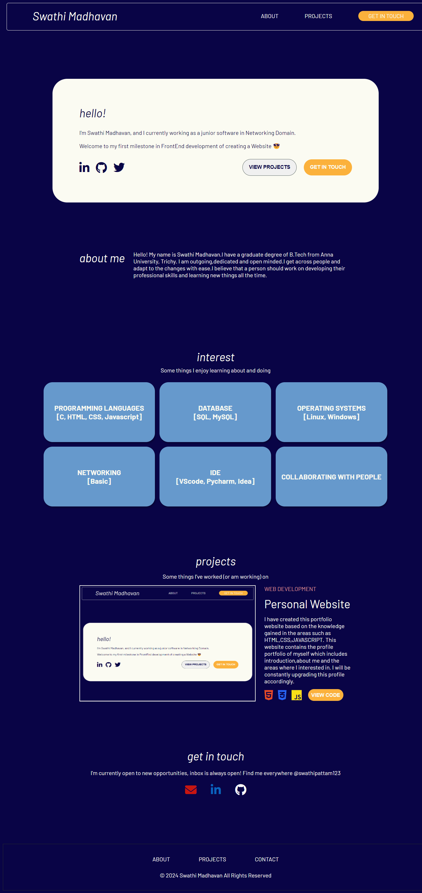

# Portfolio web app

I have created this Portfolio web app from [my static Portfolio website project](https://github.com/Swathi-Madhavan/portfolio-website). From this project, I have practiced following react skills such as  
1. Basic structure of react project
2. Functional components
3. Displaying objects and array of objects data in UI 
4. Sharing data between components
5. Conditional rendering
6. index.css file purpose
7. Reusable components creation 
8. Unidirectional data flow
9. React Props
10. Conditional styles

## Learnt skills
1. React JS
2. TypeScript
3. JavaScript
4. HTML
5. CSS

## Webpreview 
